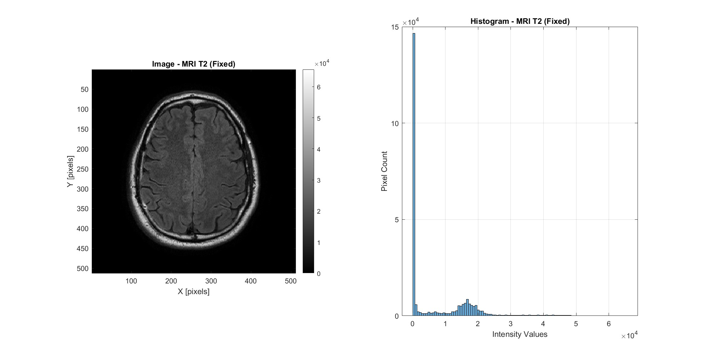
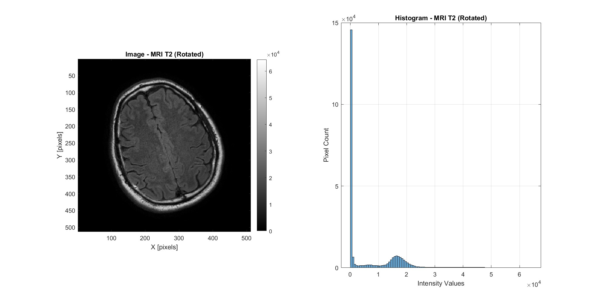
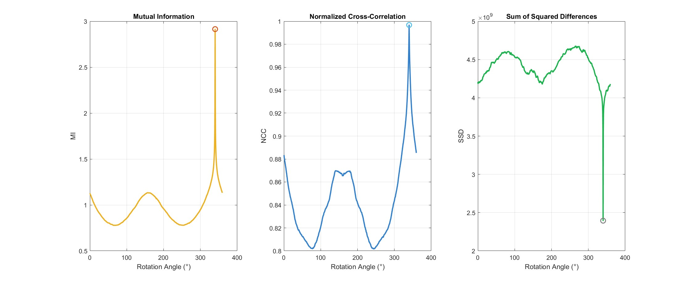
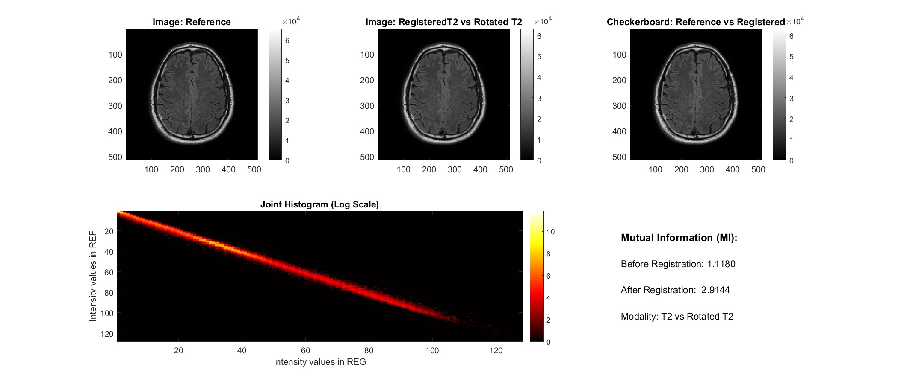
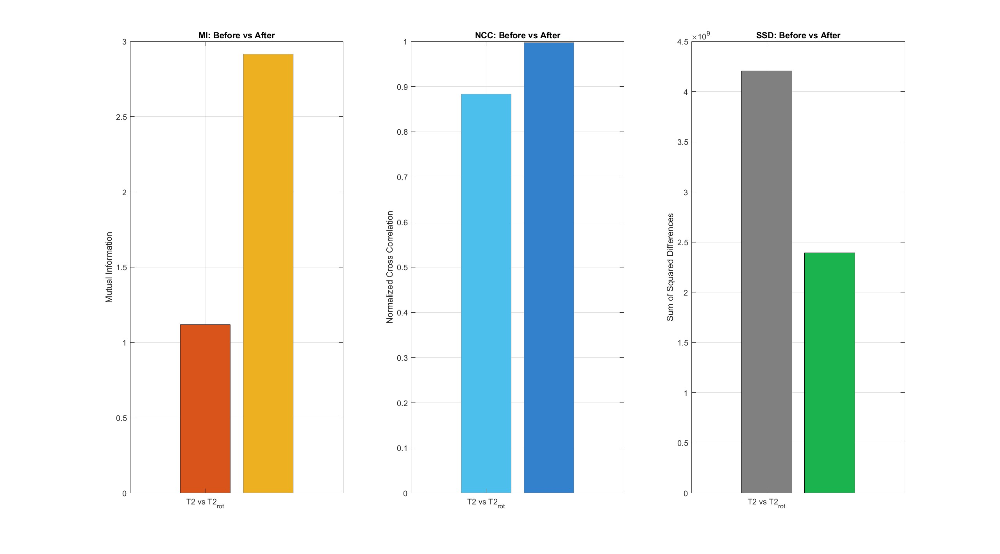

# Rotational Registration

Rigid rotation-only registration of a T2-weighted MRI brain scan against a synthetically rotated version of itself, using exhaustive angular sweep and three similarity metrics.

---

## 1. Input Images

The fixed reference is an axial T2-weighted MRI slice (512 x 512 pixels). The moving image is the same slice after an unknown rotation.

| Fixed Reference (T2) | Rotated Moving Image |
|:---:|:---:|
|  |  |

Both images share the same intensity distribution, confirming they are the same modality -- the only geometric difference is a rigid rotation.

---

## 2. Metric Sweep Across Rotation Angles

A full 360-degree sweep is performed at 0.5-degree resolution (720 candidate angles). At each angle, the moving image is rotated and scored against the fixed reference using three independent metrics:

| Metric | Optimization | Best Angle |
|--------|-------------|------------|
| **MI** (Mutual Information) | Maximize | 340.0 deg |
| **NCC** (Normalized Cross-Correlation) | Maximize | 340.0 deg |
| **SSD** (Sum of Squared Differences) | Minimize | 340.0 deg |

All three metrics converge to the same optimal angle (340.0 deg), with sharp, well-defined peaks (MI, NCC) or a valley (SSD). The NCC curve shows the cleanest peak, reaching 0.9967 at optimal alignment. The secondary peaks near 180 degrees reflect the approximate bilateral symmetry of the brain.

---

## 3. Registration Report

After applying the optimal rotation angle (340.0 deg, determined by NCC), the registered image is compared against the reference:

**Top row (left to right):**
- **Reference image** -- the target anatomy
- **Registered image** -- the moving image after optimal rotation correction
- **Checkerboard overlay** -- interleaved tiles from both images, demonstrating seamless anatomical alignment

**Bottom row:**
- **Joint histogram (log scale)** -- after registration, the joint histogram collapses toward the diagonal, indicating strong voxel-wise intensity correspondence
- **Mutual Information** -- MI increases from **1.1180** (before) to **2.9144** (after), a **2.6x improvement**

---

## 4. Quantitative Comparison: Before vs After

| Metric | Before Registration | After Registration | Change |
|--------|:---:|:---:|:---:|
| **MI** | 1.1180 | 2.9144 | +160.7% |
| **NCC** | 0.8834 | 0.9967 | +12.8% |
| **SSD** | 4.2066 x 10^9 | 2.3944 x 10^9 | -43.1% |

All metrics confirm successful registration:
- MI increases by 160.7%, indicating much stronger statistical dependence between the two images.
- NCC reaches 0.9967, approaching the theoretical maximum of 1.0 -- near-perfect linear correlation.
- SSD drops by 43.1%, showing significantly reduced pixel-wise intensity differences.

---

## Method Summary

| Parameter | Value |
|-----------|-------|
| Registration type | Rigid rotation (1 DOF) |
| Search strategy | Exhaustive angular sweep |
| Angular range | 0 -- 359.5 deg |
| Angular resolution | 0.5 deg |
| Candidates evaluated | 720 |
| Interpolation | Bilinear |
| Optimal angle | 340.0 deg (all three metrics agree) |
| Input modality | T2-weighted MRI (monomodal) |
| Image size | 512 x 512 pixels |
