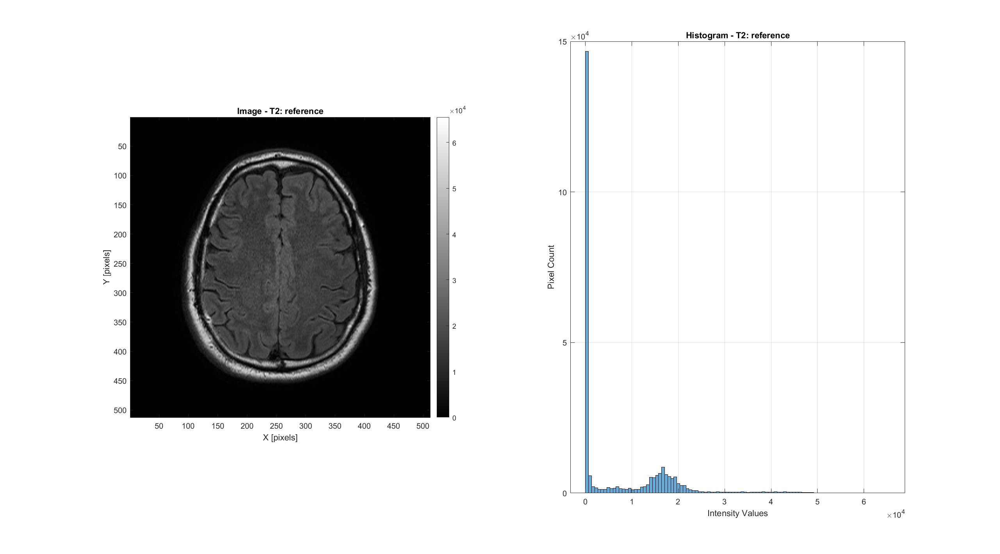
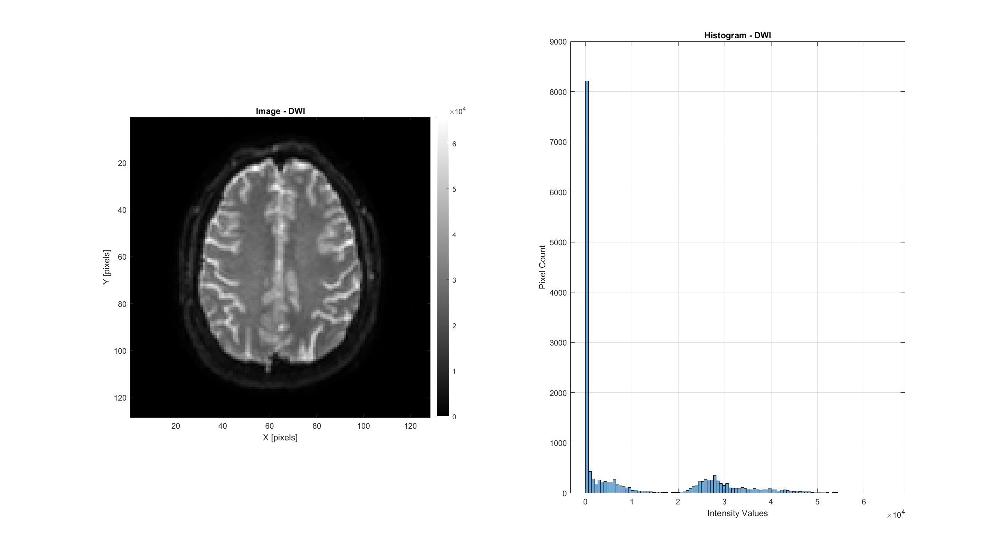
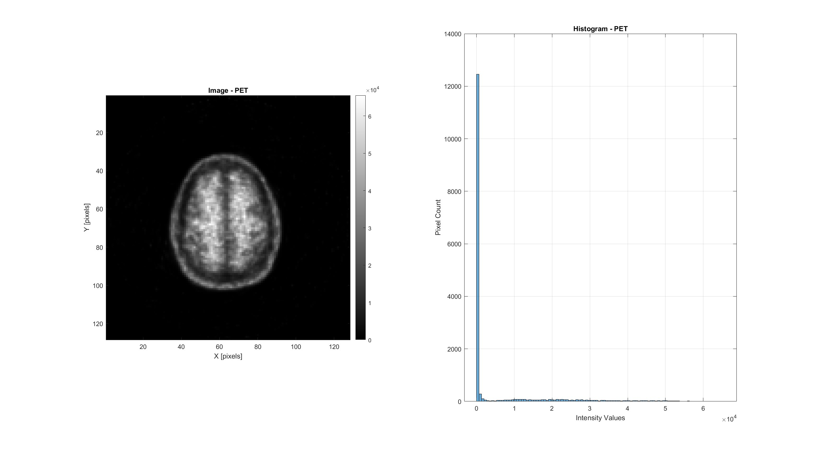
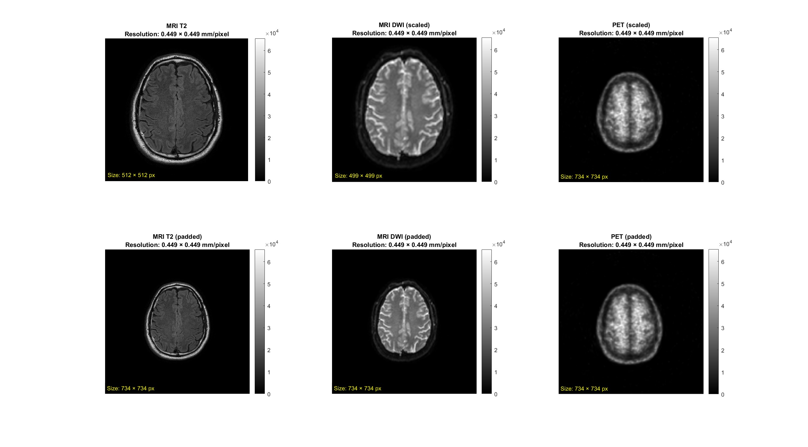
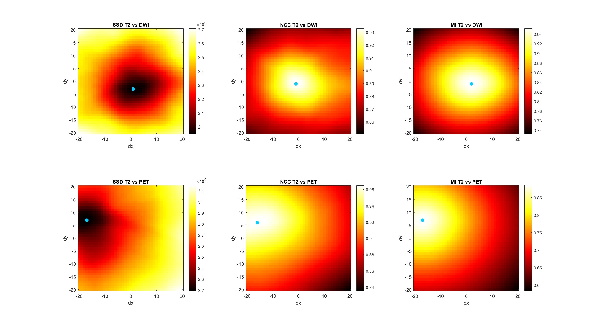
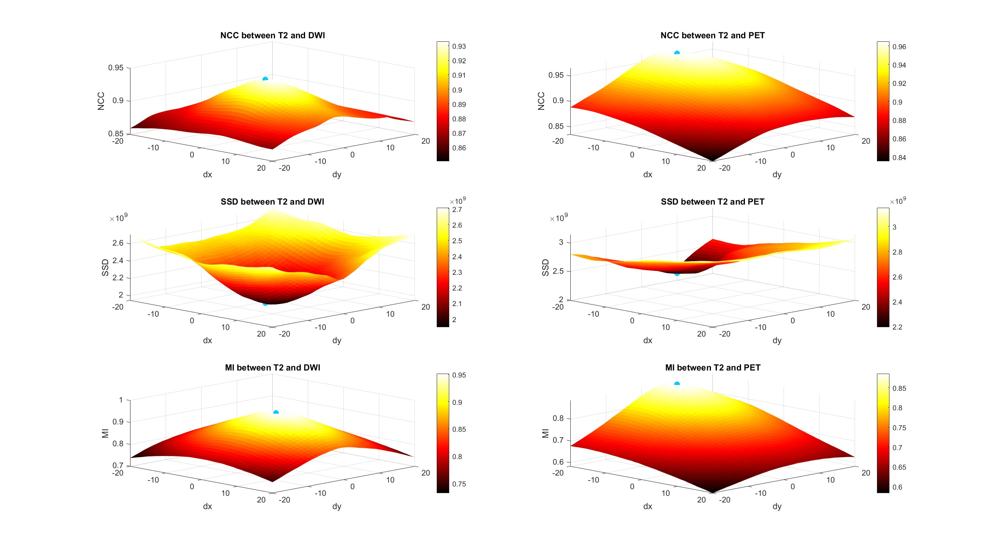
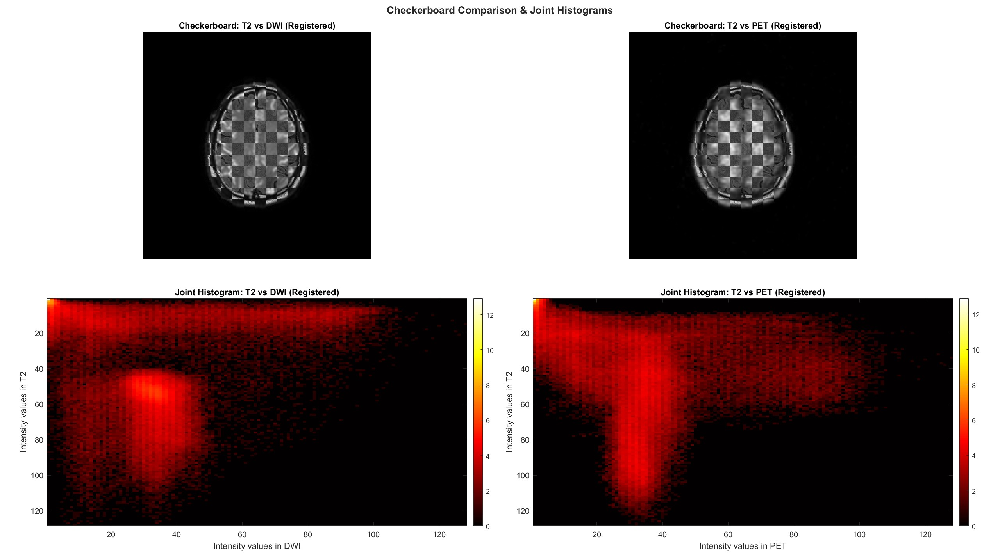
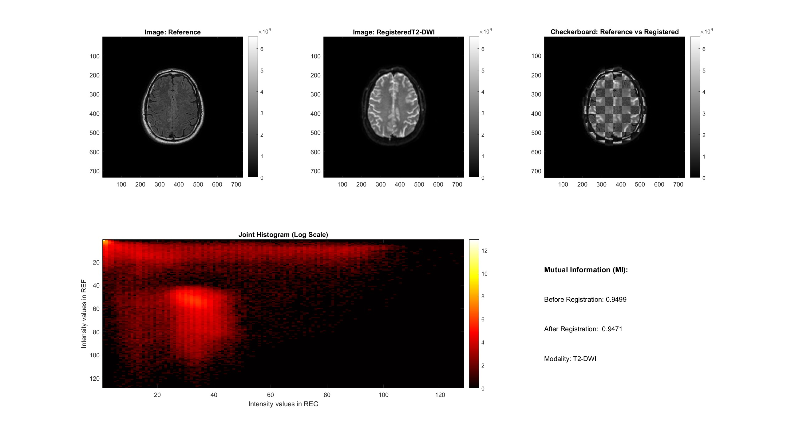
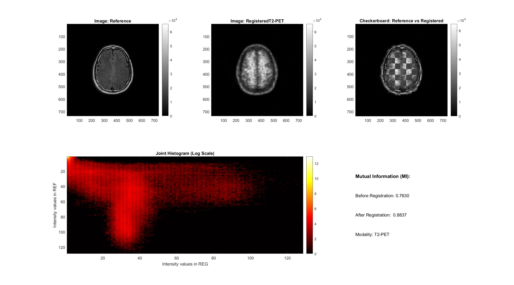
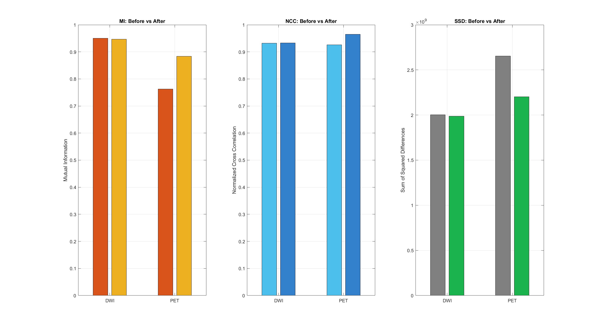

# Translational Registration

Rigid translation-only registration of multimodal brain images (MRI T2, MRI DWI, PET) onto a common anatomical reference, using exhaustive 2D grid search and three similarity metrics.

---

## 1. Input Images

Three brain imaging modalities are loaded from DICOM files. The MRI T2 scan serves as the fixed reference due to its superior anatomical contrast and spatial resolution.

**MRI T2 (Reference)**

**MRI DWI**

**PET**

| Property | MRI T2 | MRI DWI | PET |
|----------|:---:|:---:|:---:|
| **Size** | 512 x 512 | 128 x 128 | 128 x 128 |
| **Pixel Spacing** | 0.449 x 0.449 mm | 1.75 x 1.75 mm | 2.574 x 2.574 mm |

The three modalities differ significantly in resolution and pixel spacing. Before registration can be performed, all images must be resampled to a common spatial scale.

---

## 2. Preprocessing: Rescaling and Padding

Each image is rescaled to match the MRI T2 pixel spacing (0.449 mm/pixel), then zero-padded to a uniform canvas size.

| Property | MRI T2 | MRI DWI | PET |
|----------|:---:|:---:|:---:|
| **Scale Factor** | 1.0 (reference) | 3.8976 | 5.7333 |
| **Size After Scaling** | 512 x 512 | 499 x 499 | 734 x 734 |
| **Size After Padding** | 734 x 734 | 734 x 734 | 734 x 734 |

**Top row**: Rescaled images at matched pixel spacing (0.449 mm/pixel). **Bottom row**: Zero-padded images on a common 734 x 734 canvas. All images now share the same spatial resolution and dimensions, ready for pixel-wise comparison.

---

## 3. Registration: Exhaustive 2D Grid Search

A translational search is performed over a discrete grid of candidate shifts: dx, dy in [-20, +20] pixels (41 x 41 = 1681 candidate translations per modality pair). At each position, three similarity metrics are computed between the shifted moving image and the fixed T2 reference.

### Optimal Translations

| | NCC (maximize) | SSD (minimize) | MI (maximize) |
|---|:---:|:---:|:---:|
| **T2 vs DWI** | [-1, -1] | [1, -3] | [2, -1] |
| **T2 vs PET** | [-16, 6] | [-17, 7] | [-17, 7] |

*Shifts reported as [dx, dy] in pixels.*

The DWI image requires only a minimal correction (1-3 px), indicating it is already nearly aligned with T2. The PET image requires a substantially larger shift (~17 px horizontally, ~7 px vertically), consistent with the different field-of-view geometry of PET scanners. Registration is applied using the NCC-based optimal shift.

---

## 4. Metric Landscapes

### 4.1 2D Heatmaps

Each heatmap shows the metric value for every candidate translation in the [-20, +20] search range. The optimal shift is marked with a cyan dot. **Top row**: T2 vs DWI. **Bottom row**: T2 vs PET.

- **SSD** (left): the minimum (dark region) indicates best alignment.
- **NCC** (center): the maximum (bright peak) marks the optimal translation.
- **MI** (right): the maximum corresponds to the shift that maximizes statistical dependence between modalities.

The PET heatmaps show a clear, well-localized peak offset from the center, confirming the large translational misalignment. The DWI heatmaps show a peak very close to center, consistent with the small required correction.

### 4.2 3D Metric Surfaces

The same metric data rendered as 3D surfaces (left: DWI, right: PET). The surface shape reveals the smoothness of each metric landscape:
- **NCC** (top): smooth, unimodal peak -- ideal for gradient-based optimization.
- **SSD** (middle): broad valley with a clear global minimum.
- **MI** (bottom): noisier surface, but the global optimum is still identifiable. MI is particularly valuable for multimodal registration since it captures non-linear intensity relationships.

---

## 5. Registration Results

### 5.1 Checkerboard Overlays and Joint Histograms

**Top row**: Checkerboard overlays after registration. Interleaved tiles from T2 and the registered moving image demonstrate anatomical alignment -- structures flow seamlessly across tile boundaries.

**Bottom row**: Joint histograms (log scale) between T2 and the registered images. The scatter pattern reflects the intensity relationship between modalities. For the monomodal-like T2-DWI pair, the joint histogram shows tighter clustering. For the multimodal T2-PET pair, the distribution is broader, reflecting fundamentally different contrast mechanisms.

### 5.2 Registration Reports

**T2 vs DWI:**

**T2 vs PET:**

Each report includes: the reference image, the registered moving image, a checkerboard overlay, the joint histogram (log scale), and the mutual information values before and after registration.

---

## 6. Quantitative Comparison: Before vs After

Grouped bar charts comparing MI, NCC, and SSD before (unregistered) and after (registered) for both DWI and PET modalities. In all cases:
- **MI** increases after registration, confirming improved statistical dependence.
- **NCC** increases, indicating better linear correlation.
- **SSD** decreases, reflecting reduced pixel-wise intensity differences.

The improvement is larger for PET than for DWI, consistent with PET requiring a much larger translational correction (17 px vs 1 px).

---

## Method Summary

| Parameter | Value |
|-----------|-------|
| Registration type | Rigid translation (2 DOF) |
| Search strategy | Exhaustive 2D grid search |
| Search range | [-20, +20] pixels per axis |
| Candidates evaluated | 1681 per modality pair (41 x 41) |
| Interpolation | Bilinear (via `imtranslate`) |
| Optimal shift selection | NCC (highest peak) |
| Preprocessing | Rescaling to common pixel spacing + zero-padding |
| Reference modality | MRI T2 (512 x 512, 0.449 mm/pixel) |
| Moving modalities | MRI DWI (128 x 128, 1.75 mm/pixel), PET (128 x 128, 2.574 mm/pixel) |
