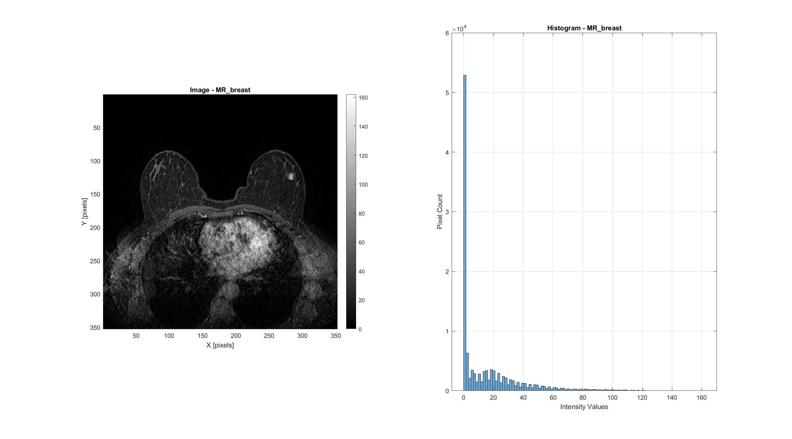
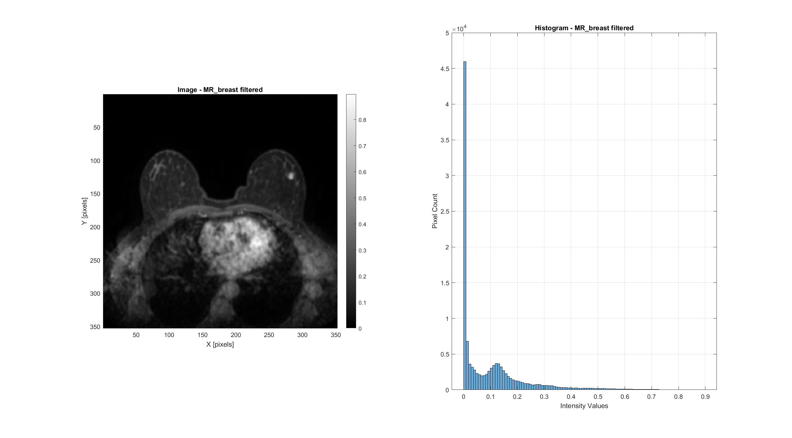
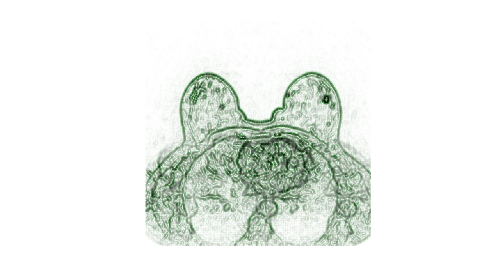
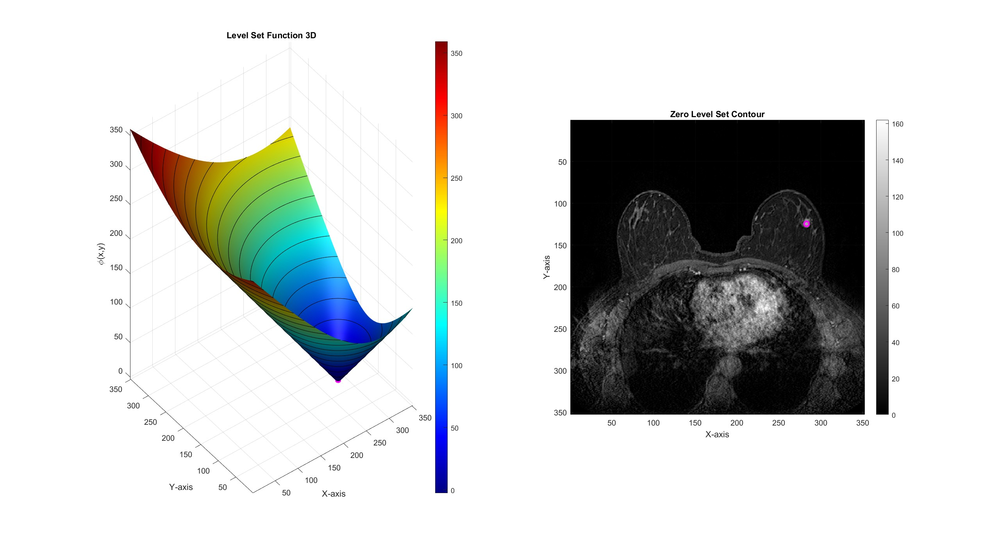
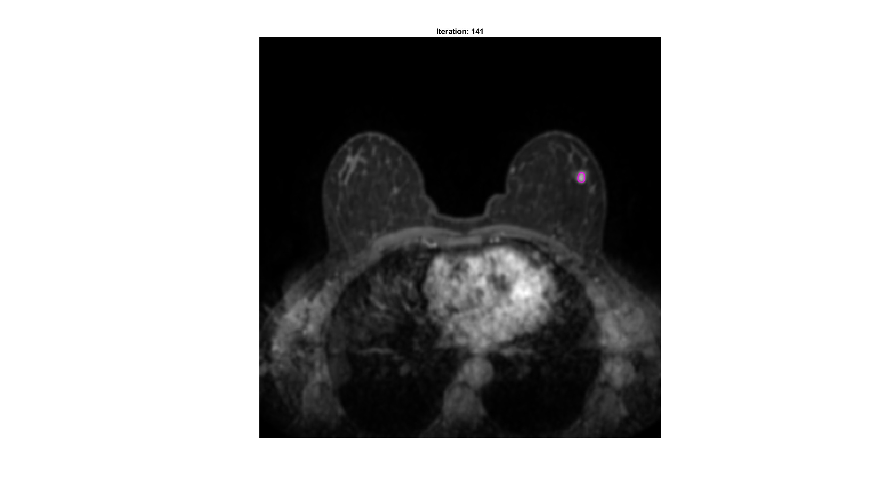
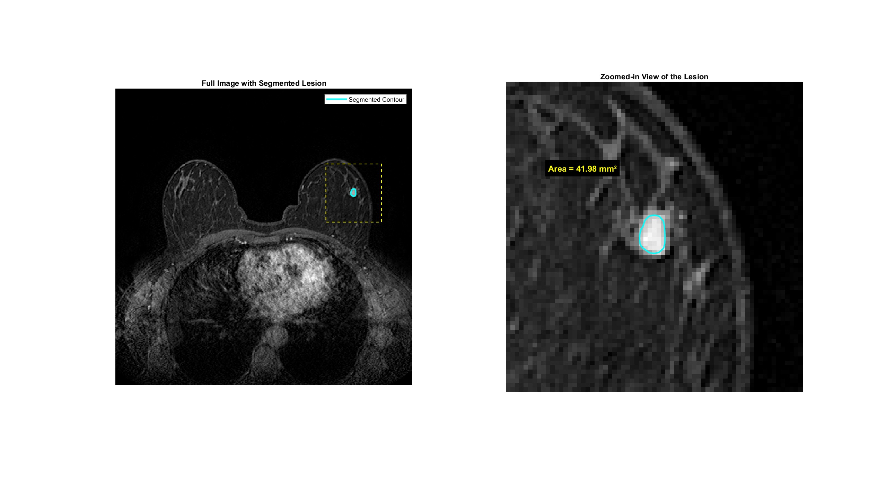

# Breast Lesion Segmentation

Segmentation of a breast lesion from a contrast-enhanced MR image using the Malladi-Sethian level-set evolution model with edge-stopping and advection forces.

---

## 1. Input Image

A single contrast-enhanced MR breast image is loaded from DICOM format.

**Original Image**

| Property | Value |
|----------|-------|
| Image size | 352 x 352 pixels |
| Pixel spacing | 0.966 x 0.966 mm |
| Total image area | 115600.0 mm² |
| Intensity range | [0, 162] |

---

## 2. Preprocessing

### 2.1 Anisotropic Diffusion

The image is normalized to [0, 1] and filtered with Perona-Malik anisotropic diffusion to reduce noise while preserving the lesion boundaries.

**Filtered Image**

| Parameter | Value |
|-----------|-------|
| Iterations | 7 |
| Time step (dt) | 1/7 |
| Edge sensitivity (kappa) | 7 |
| Diffusion option | 1 (exponential) |
| Output intensity range | [0, 0.8976] |

### 2.2 Edge Indicator Function

The edge indicator function g = 1 / (1 + |grad(I) / beta|^alpha) maps gradient magnitude to a stopping function that approaches zero at strong edges. The green quiver arrows visualize the gradient field of g, pointing toward edge locations.

| Parameter | Value |
|-----------|-------|
| Gradient scaling (beta) | 0.1 |
| Steepness (alpha) | 2 |

---

## 3. Level-Set Initialization

A small circular contour (radius=3 pixels) is initialized via interactive seed selection inside the lesion. The small radius is appropriate for targeting a compact lesion embedded in dense breast tissue.

The initial level-set function (phi) is shown as a 3D surface and as a zero-level contour overlaid on the image. The contour will expand under the evolution forces until it reaches the lesion boundary.

---

## 4. Malladi-Sethian Evolution

The level-set evolves according to:

phi_t = g * (epsilon * K - 1) * |grad(phi)| + ni * Gup(phi, fx, fy)

where K is the curvature, g is the edge indicator, and Gup is the upwind advection operator that drives the contour toward edges.

| Parameter | Value |
|-----------|-------|
| Curvature weight (epsilon) | 3 |
| Advection weight (ni) | 2 |
| Time step (dt) | 0.1 |
| Initial radius | 3 pixels |
| Max iterations | 1500 |
| Convergence | Iteration 141 (area stable over 10 iterations) |

The contour converges at iteration 141, delineating the lesion boundary. The relatively small final area (44 pixels) confirms that the lesion is a compact, well-circumscribed structure.

---

## 5. Final Segmentation Results

The final visualization shows the full breast MR image with the segmented lesion contour (cyan) and a yellow dashed rectangle indicating the zoomed region. The zoomed view (right panel) provides a close-up of the lesion with the reported area.

| Result | Value |
|--------|-------|
| **Segmented area (pixels)** | 44 px² |
| **Segmented area (physical)** | 41.05 mm² |
| **Pixel spacing** | 0.966 x 0.966 mm |

---

## Method Summary

| Parameter | Value |
|-----------|-------|
| Segmentation algorithm | Malladi-Sethian level-set evolution |
| Preprocessing | Normalization + Perona-Malik anisotropic diffusion |
| Edge indicator | g = 1 / (1 + \|grad(I) / beta\|^alpha) |
| Advection weight | 2.0 |
| Curvature weight | 3.0 |
| Convergence criterion | Area unchanged over 10 consecutive iterations |
| Input modality | Contrast-enhanced breast MRI |
| Image size | 352 x 352 pixels |
| Pixel spacing | 0.966 x 0.966 mm |
