# Kidney and Medulla Segmentation

Two-stage Chan-Vese level-set segmentation of the kidney outer boundary and internal medulla from axial CT scans, preceded by translational registration to compensate for patient motion between contrast-enhanced and non-contrast acquisitions.

---

## 1. Input Images

Two axial CT slices of the same patient are loaded: one acquired with contrast agent (fixed reference) and one without. Minor patient motion between the two acquisitions requires registration before joint analysis.

**CT With Contrast Agent (Fixed)**
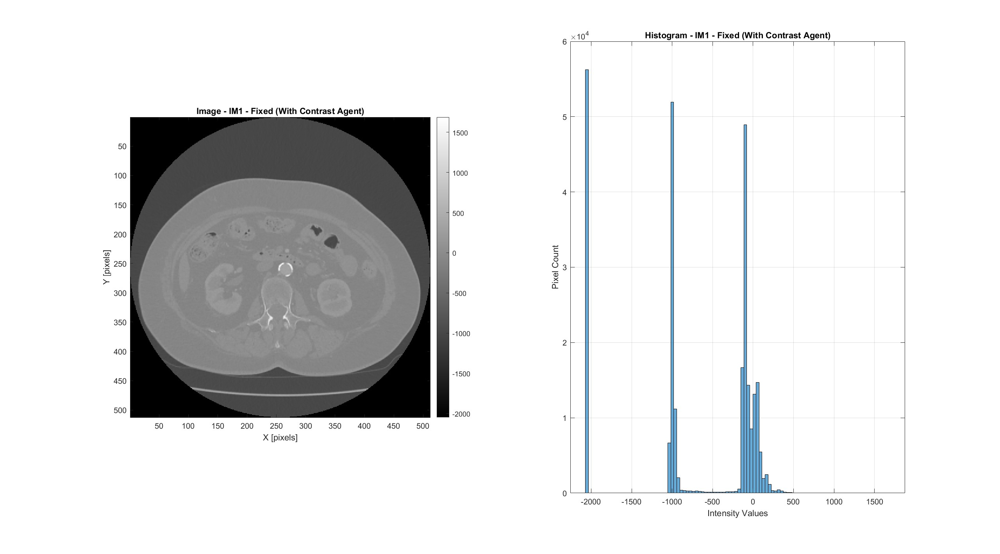

**CT Without Contrast Agent (Moving)**
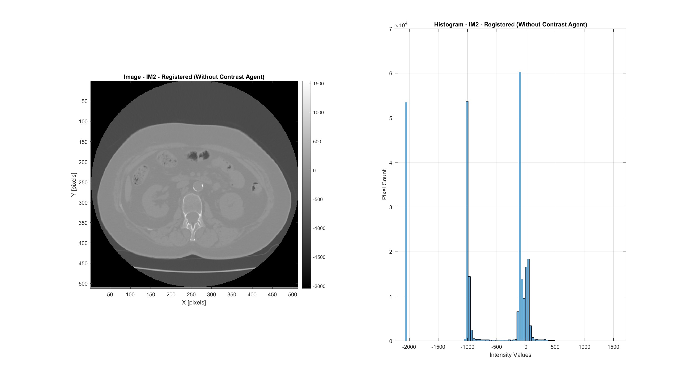

| Property | Value |
|----------|-------|
| Image size | 512 x 512 pixels |
| Pixel spacing | 0.705 x 0.705 mm |
| Total image area | 130292.12 mm² |
| Intensity range (contrast) | [-2048, 1688] |
| Intensity range (no contrast) | [-2048, 1538] |

---

## 2. Registration

A translation-only registration aligns the non-contrast image to the contrast-enhanced reference. The user selects a ROI on the fixed image, and an exhaustive 2D grid search (shift range: [-10, +10] pixels) finds the translation that maximizes Normalized Cross-Correlation (NCC) between the cropped regions.

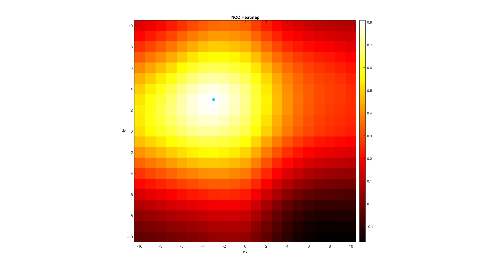

The NCC heatmap shows a clear peak at the optimal shift, confirming a well-defined alignment solution.

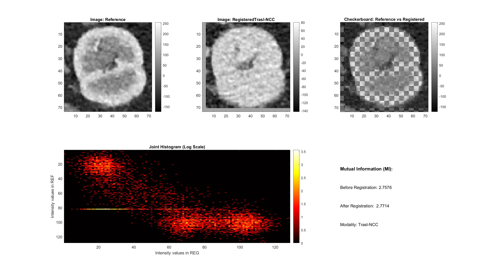

| Parameter | Value |
|-----------|-------|
| Optimal shift (dx, dy) | [-3, 3] pixels |
| NCC at optimum | 0.8043 |
| Registration type | Rigid translation (2 DOF) |
| Search range | [-10, +10] pixels per axis |

After registration, both images are spatially aligned and can be cropped to the same anatomical region for segmentation.

---

## 3. Preprocessing

### 3.1 ROI Selection

The user selects a rectangular region of interest (ROI) centered on the kidney. The same ROI is applied to both the contrast-enhanced and registered non-contrast images.

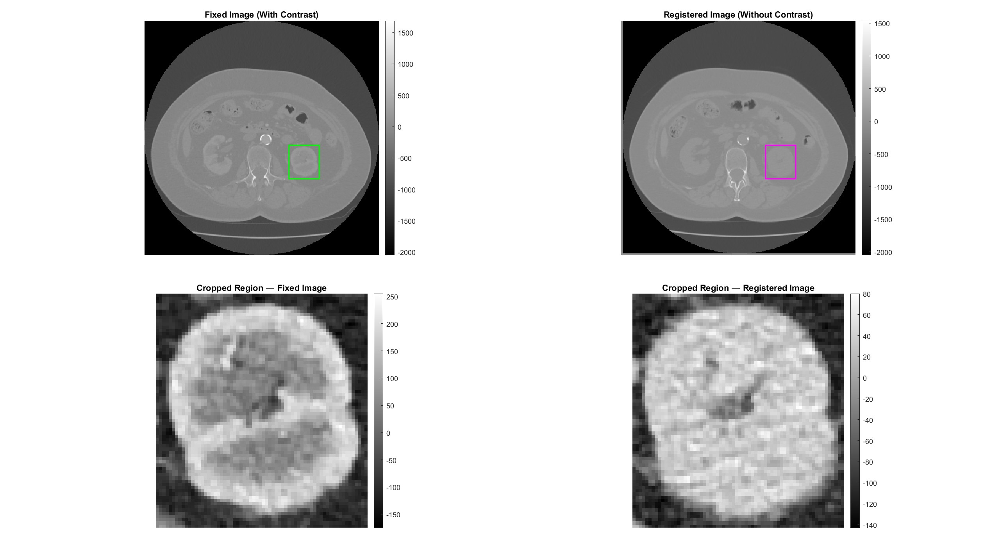

| Property | Value |
|----------|-------|
| ROI top-left | (x=313, y=274) |
| ROI size | 71 x 71 pixels |

### 3.2 Intensity Normalization

Both cropped regions are normalized to [0, 1] using `mat2gray` to enable consistent thresholding and level-set evolution.

**Cropped ROI -- With Contrast (Normalized)**
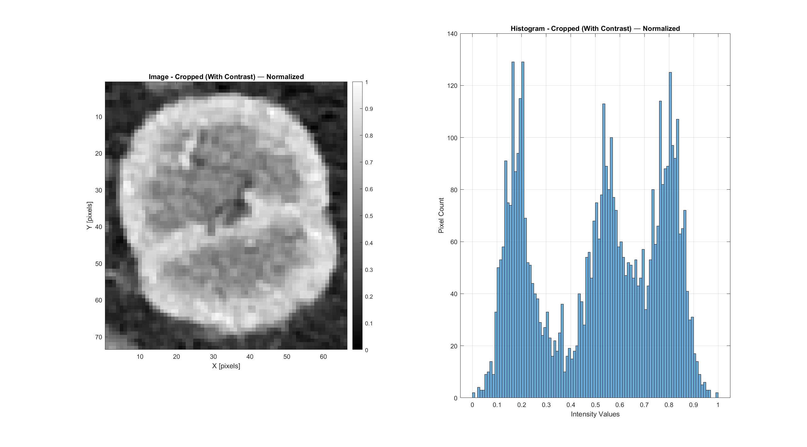

**Cropped ROI -- Without Contrast (Normalized)**
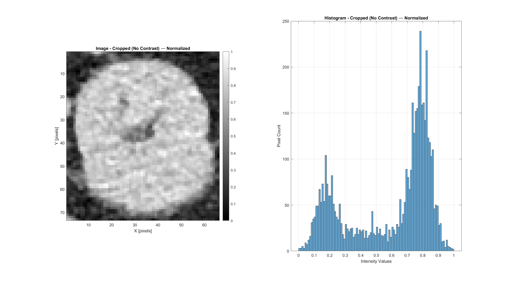

### 3.3 Contrast Enhancement and Smoothing

Two different preprocessing pipelines are applied, each tailored to the downstream segmentation task:

- **Contrast-enhanced image** (used for medulla segmentation): sigmoid contrast stretching (center=0.65, sharpness=20) followed by Gaussian smoothing (sigma=1.0). This enhances the medulla structures that are visible thanks to the contrast agent.

- **Non-contrast image** (used for kidney boundary segmentation): sigmoid contrast stretching followed by Perona-Malik anisotropic diffusion (15 iterations, kappa=30, dt=1/7). This smooths homogeneous regions while preserving the sharp kidney boundary.

**With Contrast -- After Gaussian Smoothing**
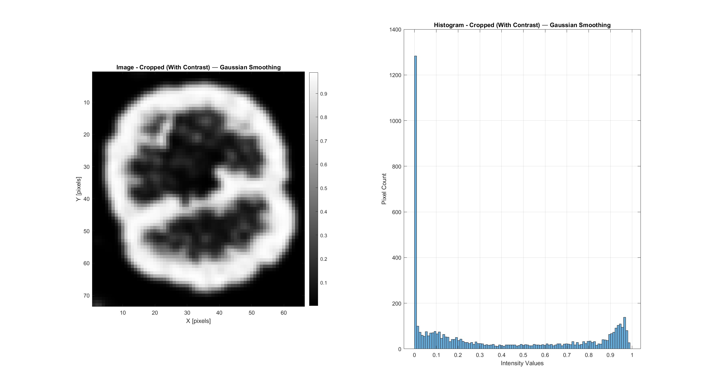

**Without Contrast -- After Anisotropic Diffusion**
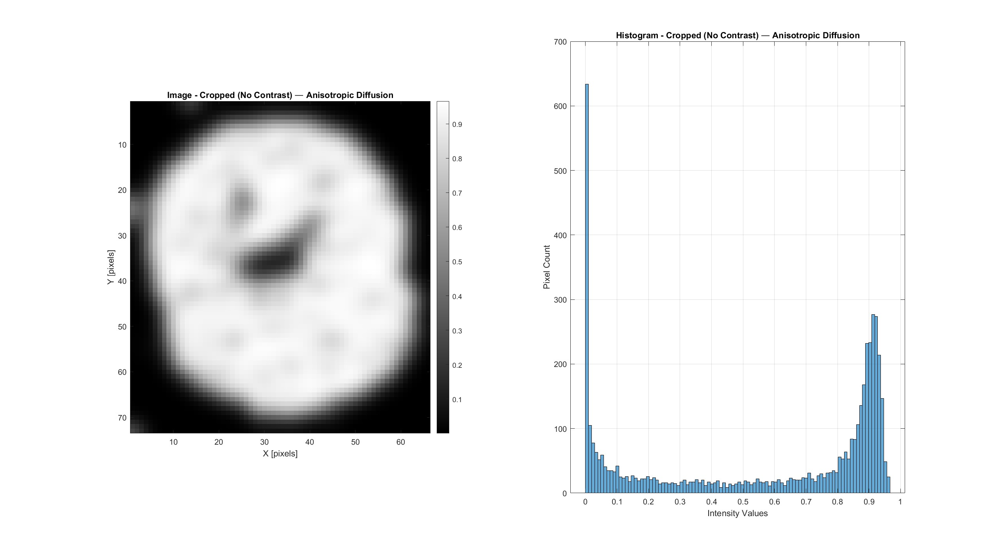

---

## 4. First Segmentation: Kidney Outer Boundary

The kidney boundary is segmented from the **non-contrast image** (after anisotropic diffusion) using the Chan-Vese active contour model. The level-set function is initialized with an interactive seed point and a circular contour (radius=30 pixels).

### 4.1 Level-Set Initialization

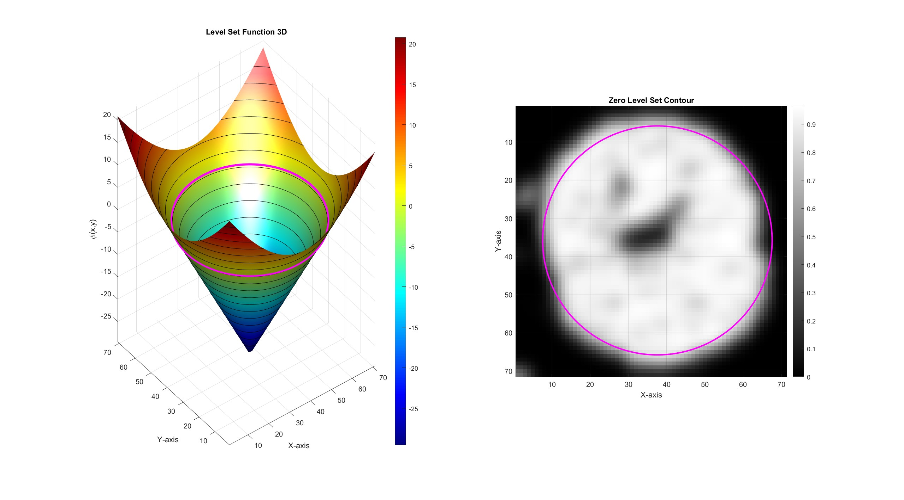

The initial level-set function (phi) is shown as a 3D surface (left) and as a zero-level contour overlaid on the image (right). The circular contour encloses the kidney region and will evolve inward/outward to fit the true boundary.

### 4.2 Chan-Vese Evolution

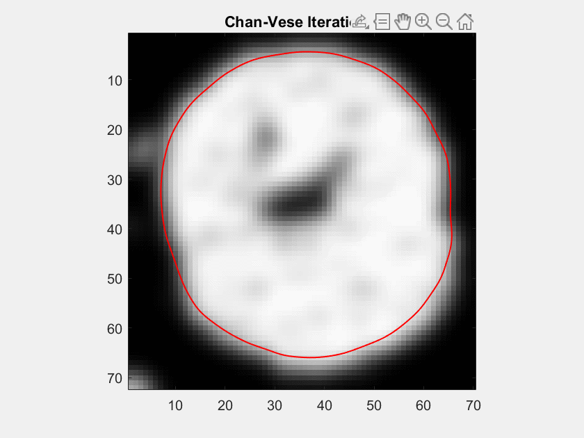

| Parameter | Value |
|-----------|-------|
| Curvature weight (mu) | 0.5 |
| Inside fidelity (lambda1) | 30 |
| Outside fidelity (lambda2) | -30 |
| Balloon force (ni) | 0.0 |
| Time step | 0.1 |
| Initial radius | 30 pixels |
| Convergence | Early stop at iteration 12 (area change < 1%) |

The contour converges rapidly (12 iterations), indicating a strong intensity contrast between the kidney parenchyma and the surrounding tissue in the non-contrast image. Post-processing includes morphological reconstruction from the seed point and hole filling to produce a clean binary mask.

**Kidney segmented area: 1504.49 mm²**

---

## 5. Second Segmentation: Medulla

The internal medulla structures are segmented from the **contrast-enhanced image** (after Gaussian smoothing) using the same Chan-Vese model, but with a smaller initial contour (radius=5 pixels) placed interactively on a medulla region.

### 5.1 Level-Set Initialization

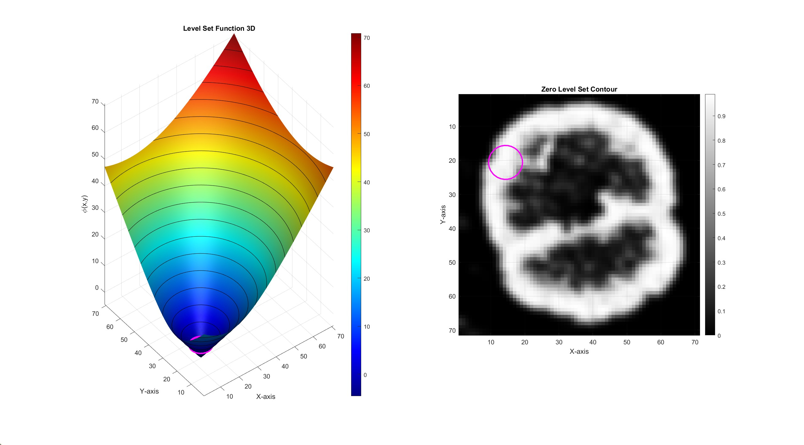

The small initial contour is placed inside one of the medulla pyramids. The level-set will expand to capture all connected medulla tissue.

### 5.2 Chan-Vese Evolution

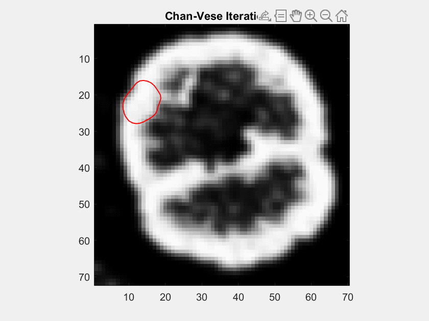

| Parameter | Value |
|-----------|-------|
| Curvature weight (mu) | 0.5 |
| Inside fidelity (lambda1) | 30 |
| Outside fidelity (lambda2) | -30 |
| Balloon force (ni) | 0.0 |
| Time step | 0.1 |
| Initial radius | 5 pixels |
| Convergence | Early stop at iteration 83 (area change < 1%) |

The medulla segmentation requires significantly more iterations (83 vs 12) due to the complex, multi-lobed geometry of the medulla pyramids and the more subtle intensity differences in the contrast-enhanced image. The final medulla mask is refined by intersecting with an eroded version of the kidney mask (disk structuring element, radius=5), ensuring medulla regions lie strictly within the kidney boundary.

---

## 6. Final Segmentation Results

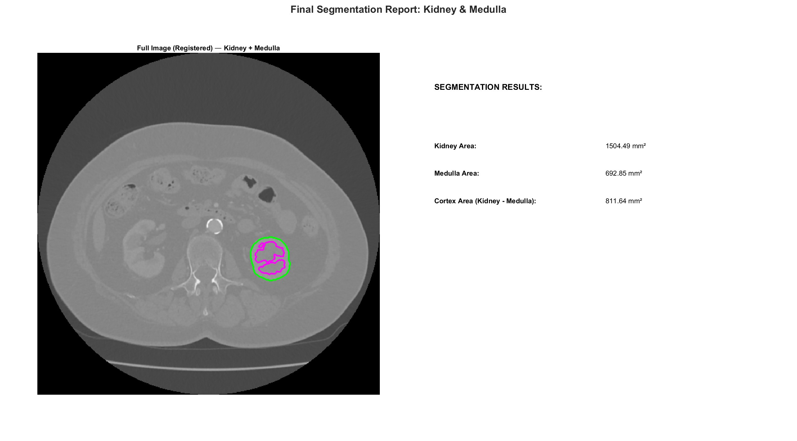

The final overlay shows the kidney boundary (green) and medulla regions (magenta) on the full contrast-enhanced CT image. The cortex is computed as the difference between the kidney and medulla masks.

| Structure | Area |
|-----------|------|
| **Kidney** (outer boundary) | 1504.49 mm² |
| **Medulla** (internal structures) | 692.85 mm² |
| **Cortex** (kidney - medulla) | 811.64 mm² |

The cortex accounts for 53.9% of the total kidney area, consistent with normal renal anatomy where the cortex constitutes approximately half of the kidney cross-section.

---

## Method Summary

| Parameter | Value |
|-----------|-------|
| Segmentation algorithm | Chan-Vese active contours (2 passes) |
| Registration | Translation-only, NCC-based grid search |
| Preprocessing (kidney) | Normalization + sigmoid + anisotropic diffusion |
| Preprocessing (medulla) | Normalization + sigmoid + Gaussian smoothing |
| Post-processing | Morphological reconstruction + hole filling + mask intersection |
| Input modality | Axial CT (with and without contrast agent) |
| Pixel spacing | 0.705 x 0.705 mm |
| ROI size | 71 x 71 pixels |
