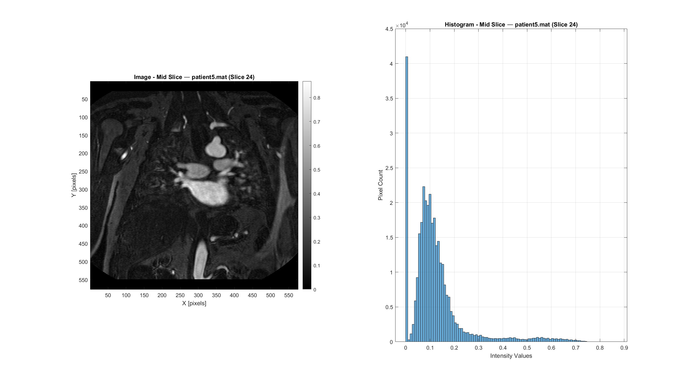
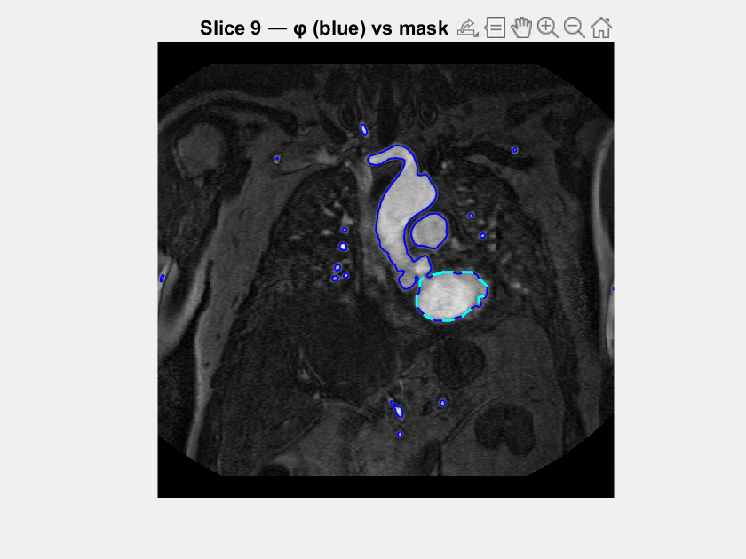
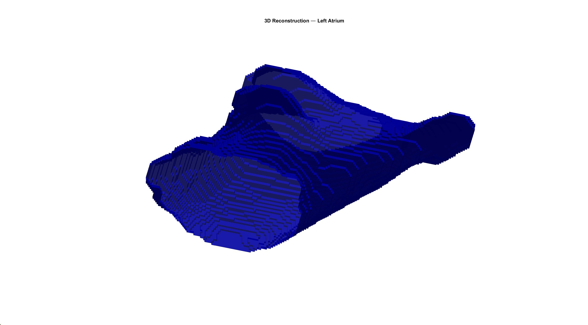

# 3D Left Atrium Segmentation

Volumetric segmentation of the left atrium from a 3D MRI stack using slice-by-slice Chan-Vese level-set evolution, followed by 3D surface mesh reconstruction via iso2mesh.

---

## 1. Input Volume

A 3D MRI volume (patient5.mat) is loaded, containing 47 axial slices of the cardiac region.

**Mid Slice (Slice 24)**

| Property | Value |
|----------|-------|
| Volume size | 576 x 576 x 47 slices |
| Pixel spacing | 0.69 x 0.69 mm |
| Slice thickness | 1.50 mm |
| Slice image area | 159016.91 mm² |

---

## 2. Preprocessing

Each slice undergoes two preprocessing steps before segmentation:

1. **Intensity normalization** to [0, 1] via `mat2gray`
2. **Perona-Malik anisotropic diffusion** to reduce noise while preserving the atrial boundaries

| Parameter | Value |
|-----------|-------|
| Iterations | 5 |
| Time step (dt) | 0.1 |
| Edge sensitivity (kappa) | 15 |
| Diffusion option | 2 (quadratic) |

---

## 3. Slice-by-Slice Chan-Vese Segmentation

The left atrium is segmented on slices 9 through 35 (27 slices total). For each slice:

1. A level-set function (phi) is initialized as a small circle (radius=3 px) centered on the atrium
2. The Chan-Vese active contour evolves until convergence (area change < 1%)
3. Post-processing refines the mask: morphological erosion/dilation (disk, r=9), connected component selection from the seed point, and hole filling

The seed point is updated interactively every 10 slices to track the atrium position as it shifts across the volume.

| Parameter | Value |
|-----------|-------|
| Curvature weight (mu) | 0.5 |
| Inside fidelity (lambda1) | 30 |
| Outside fidelity (lambda2) | -30 |
| Balloon force (ni) | 0.0 |
| Time step | 1.0 |
| Initial radius | 3 pixels |
| Max iterations per slice | 100 |
| Convergence check interval | 5 iterations |
| Seed update frequency | Every 10 slices |

### Segmentation Animation

The animated GIF below shows the segmented contour overlaid on each slice, progressing through the volume from slice 9 to slice 35. The blue contour represents the raw level-set zero-crossing, and the dashed cyan contour shows the post-processed (morphologically cleaned) mask.

### Per-Slice Area Profile

| Slice | Area (mm²) | | Slice | Area (mm²) | | Slice | Area (mm²) |
|:---:|:---:|---|:---:|:---:|---|:---:|:---:|
| 9 | 1990.97 | | 18 | 3138.87 | | 27 | 2613.57 |
| 10 | 2075.80 | | 19 | 3218.43 | | 28 | 2556.05 |
| 11 | 2122.30 | | 20 | 3301.35 | | 29 | 2468.34 |
| 12 | 2181.73 | | 21 | 3630.62 | | 30 | 2289.09 |
| 13 | 2247.87 | | 22 | 3528.53 | | 31 | 2128.53 |
| 14 | 2424.25 | | 23 | 3292.24 | | 32 | 1963.17 |
| 15 | 2559.89 | | 24 | 3091.42 | | 33 | 1782.00 |
| 16 | 2692.17 | | 25 | 2883.89 | | 34 | 1566.80 |
| 17 | 2885.33 | | 26 | 2724.76 | | 35 | 1187.20 |

The area profile follows the expected anatomical pattern: the left atrium cross-section grows from the inferior slices, reaches a maximum at slice 21 (3630.62 mm²), and tapers off toward the superior slices.

---

## 4. 3D Mesh Reconstruction

The binary segmentation masks from all 27 slices are combined into a 3D volume, and a triangulated surface mesh is extracted using iso2mesh's `binsurface` function. Vertex coordinates are converted from voxel indices to physical millimeters using the pixel spacing and slice thickness.

---

## 5. Volumetric Results

| Result | Value |
|--------|-------|
| **Number of segmented slices** | 27 |
| **Average LA area per slice** | 2538.71 mm² |
| **Total segmented volume** | 102817.76 mm³ |
| **Total segmented volume** | ~102.8 cm³ |

---

## Method Summary

| Parameter | Value |
|-----------|-------|
| Segmentation algorithm | Chan-Vese active contours (slice-by-slice) |
| Preprocessing | Normalization + Perona-Malik anisotropic diffusion |
| Post-processing | Erosion/dilation + connected component selection + hole filling |
| 3D reconstruction | iso2mesh `binsurface` triangulated mesh |
| Slice range | 9 -- 35 (27 slices) |
| Input modality | 3D cardiac MRI (patient5.mat) |
| Pixel spacing | 0.69 x 0.69 mm |
| Slice thickness | 1.50 mm |
