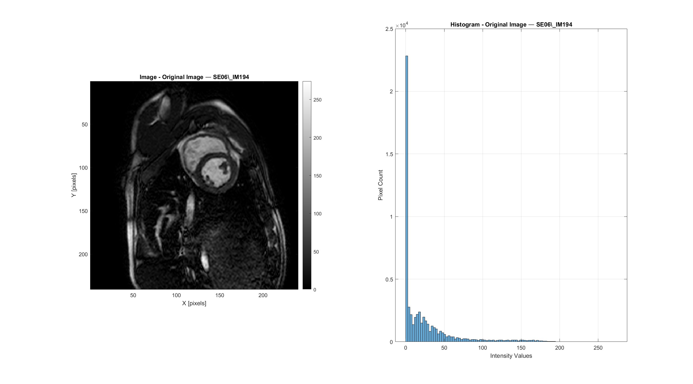
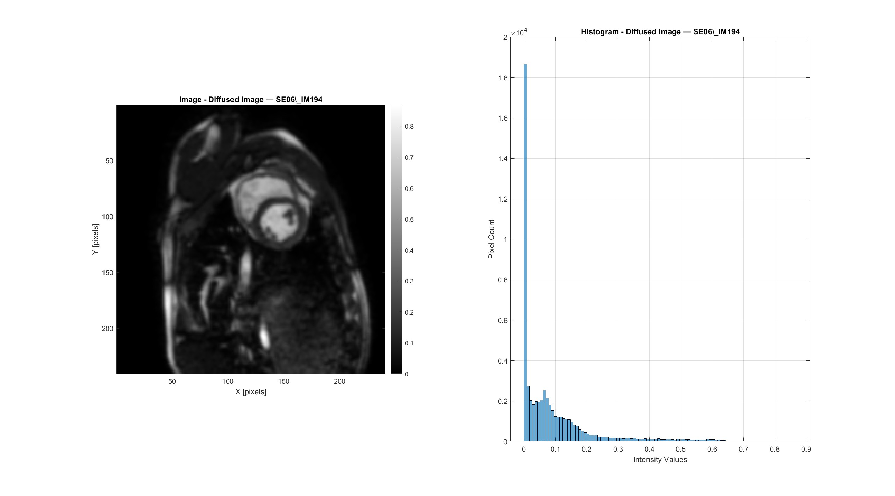
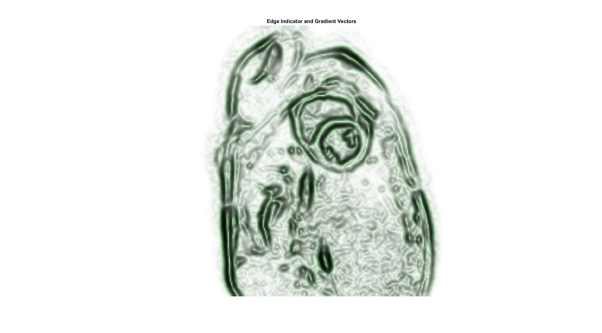
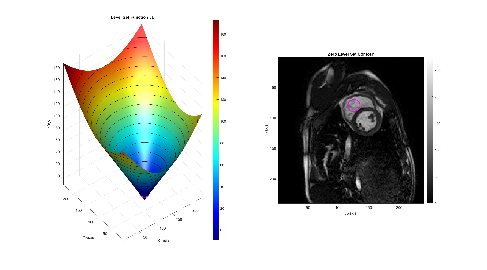
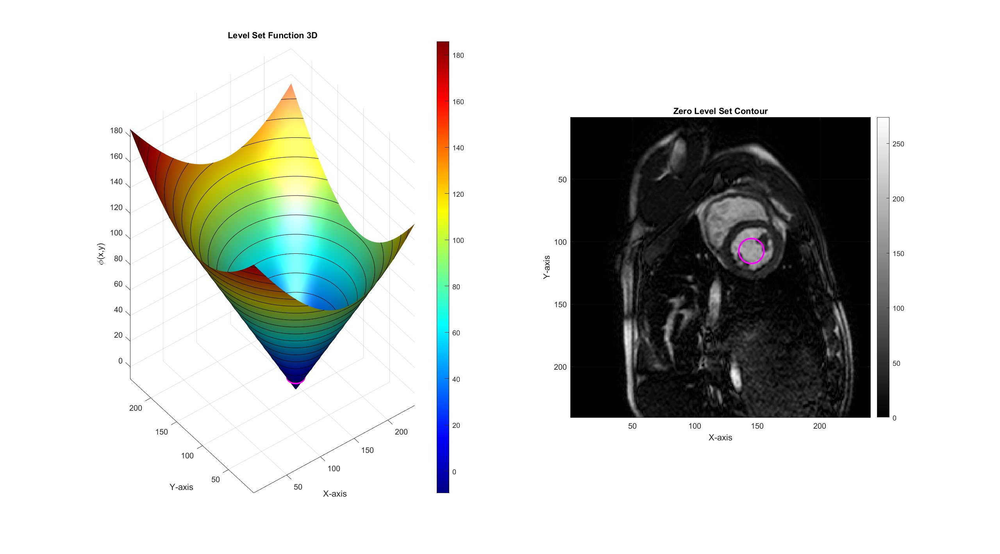
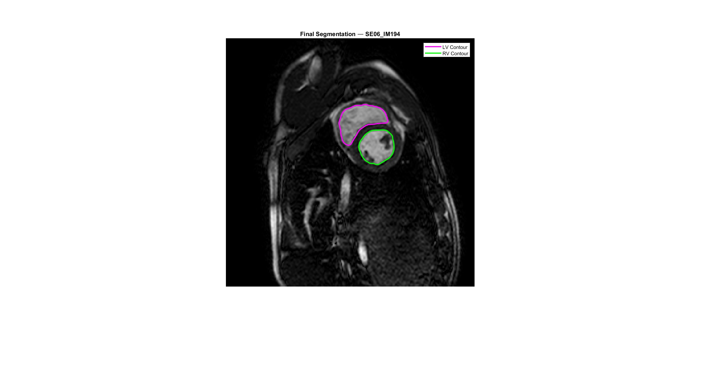

# Left and Right Ventricle Segmentation

Endocardial segmentation of the left (LV) and right (RV) ventricles from a short-axis cardiac MRI slice, using the Malladi-Sethian level-set evolution model with edge-stopping and advection forces.

---

## 1. Input Image

A single short-axis cardiac MRI slice (SE06_IM194) is loaded from DICOM format. The image captures both ventricles in cross-section.

**Original Image**

| Property | Value |
|----------|-------|
| Image size | 240 x 240 pixels |
| Pixel spacing | 1.4167 x 1.4167 mm |
| Total image area | 115600.0 mm² |
| Intensity range | [0, 274] |

---

## 2. Preprocessing

### 2.1 Anisotropic Diffusion

The image is normalized to [0, 1] and filtered with Perona-Malik anisotropic diffusion to reduce noise while preserving the sharp myocardial boundaries.

**Diffused Image**

| Parameter | Value |
|-----------|-------|
| Iterations | 7 |
| Time step (dt) | 1/7 |
| Edge sensitivity (kappa) | 7 |
| Diffusion option | 1 (exponential) |
| Output intensity range | [0, 0.8682] |

### 2.2 Edge Indicator Function

The edge indicator function g = 1 / (1 + |grad(I) / beta|^alpha) maps gradient magnitude to a stopping function: values near 0 at strong edges, near 1 in homogeneous regions. This guides the level-set evolution to halt at anatomical boundaries.

| Parameter | Value |
|-----------|-------|
| Gradient scaling (beta) | 0.1 |
| Steepness (alpha) | 2 |

The green quiver arrows show the gradient field of g, pointing toward edges. The ventricle cavities appear as bright (high g) regions surrounded by dark (low g) myocardial boundaries, providing a natural stopping criterion for the evolving contour.

---

## 3. Left Ventricle Segmentation

The LV is segmented using the Malladi-Sethian level-set model. A circular contour (radius=10 px) is initialized via interactive seed selection inside the LV cavity.

### 3.1 Level-Set Initialization

The initial level-set function (phi) is shown as a 3D surface and as a zero-level contour overlaid on the image. The small circular contour will expand outward under the evolution forces until it reaches the endocardial boundary.

### 3.2 Malladi-Sethian Evolution

The level-set evolves according to:

phi_t = g * (epsilon * K - 1) * |grad(phi)| + ni * Gup(phi, fx, fy)

where K is the curvature, g is the edge indicator, and Gup is the upwind advection operator that drives the contour toward edges.

| Parameter | Value |
|-----------|-------|
| Curvature weight (epsilon) | 3 |
| Advection weight (ni) | 2 |
| Time step (dt) | 0.1 |
| Initial radius | 10 pixels |
| Max iterations | 1500 |
| Convergence | Iteration 328 (area stable over 10 iterations) |

| Result | Value |
|--------|-------|
| **Segmented area (pixels)** | 1023 px² |
| **Segmented area (physical)** | 2053.10 mm² |

---

## 4. Right Ventricle Segmentation

The RV is segmented with the same model but a lower advection weight (ni=0.8 vs 2.0), reflecting the more complex, crescent-shaped RV geometry that requires a more conservative expansion to avoid leaking through thin myocardial walls.

### 4.1 Level-Set Initialization

### 4.2 Malladi-Sethian Evolution

| Parameter | Value |
|-----------|-------|
| Curvature weight (epsilon) | 3 |
| Advection weight (ni) | 0.8 |
| Time step (dt) | 0.1 |
| Initial radius | 10 pixels |
| Max iterations | 1500 |
| Convergence | Iteration 332 (area stable over 10 iterations) |

| Result | Value |
|--------|-------|
| **Segmented area (pixels)** | 883 px² |
| **Segmented area (physical)** | 1772.13 mm² |

The RV requires a comparable number of iterations (332 vs 328) despite the lower advection force, suggesting the contour explores the complex RV cavity shape before stabilizing.

---

## 5. Final Segmentation Results

The final overlay shows both ventricle contours on the original cardiac MRI: LV (magenta) and RV (green). The contours capture the endocardial boundaries including trabeculae and papillary muscles.

| Structure | Area (px²) | Area (mm²) |
|-----------|:---:|:---:|
| **Left Ventricle** | 1023 | 2053.10 |
| **Right Ventricle** | 883 | 1772.13 |
| **Total** | 1906 | 3825.24 |

The LV area is 15.9% larger than the RV, consistent with normal cardiac anatomy where the left ventricle has a thicker wall and larger cavity in short-axis cross-section.

---

## Method Summary

| Parameter | Value |
|-----------|-------|
| Segmentation algorithm | Malladi-Sethian level-set evolution |
| Preprocessing | Normalization + Perona-Malik anisotropic diffusion |
| Edge indicator | g = 1 / (1 + \|grad(I) / beta\|^alpha) |
| LV advection weight | 2.0 (aggressive expansion) |
| RV advection weight | 0.8 (conservative expansion) |
| Convergence criterion | Area unchanged over 10 consecutive iterations |
| Input modality | Short-axis cardiac MRI (SE06_IM194) |
| Pixel spacing | 1.4167 x 1.4167 mm |
